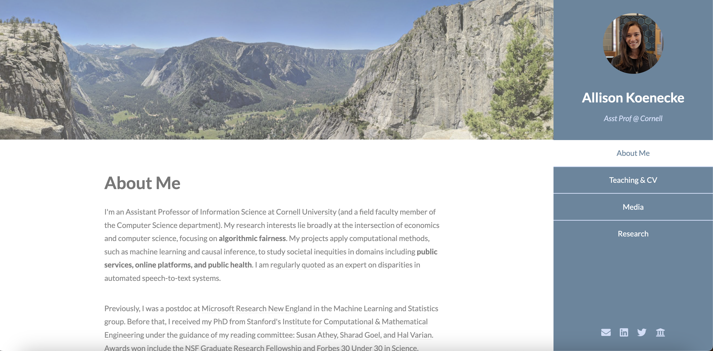

# Project 1, Milestone 2: Design Journey

[← Table of Contents](design-journey.md)

**Replace ALL _TODOs_ with your work.** (There should be no TODOs in the final submission.)

Be clear and concise in your writing. Bullets points are encouraged.

Place all design journey images inside the "design-plan" folder and then link them in Markdown so that they are visible in Markdown Preview.

**Everything, including images, must be visible in _Markdown: Open Preview_.** If it's not visible in the Markdown preview, then we can't grade it. We also can't give you partial credit either. **Please make sure your design journey should is easy to read for the grader;** in Markdown preview the question _and_ answer should have a blank line between them.

## Example Website CSS Property Analysis

For each example website you identified in milestone 1:

1. Include the same screenshot of the example website you included in Milestone 1.
2. Identify 2 parts of the design that you want to analyze for CSS properties.
3. For each part of the design, list the CSS properties for shape, color, and typography that you might use to create a similar design on your personal website.

### Example Website 1 CSS Property Analysis

<(https://koenecke.infosci.cornell.edu/)>

1. I want to analyze the sidebar of this website.

    Shape CSS Properties:

      - width: 100px;
      - height: 500px;

    Color CSS Properties:

      - backgrond-color: #3291a8;
      - color: #e8f8fc;

    Typography CSS Properties:

      - font-weight: 4px;
      - font-style: normal;

2. The first paragraph

    Shape CSS Properties:

      - width: 400px;
      - height: 100px;
      - margin: 20px;

    Color CSS Properties:

      - border: 1px solid #dbd7d7;
      - color: #787373;

    Typography CSS Properties:

      - font-family: "Lato", sans-serif;
      - font-size: 16px;
      - font-weight: 400;

### Example Website 2 CSS Property Analysis

<(https://andrewkurochkin.com/about)>

1. Header

    Shape CSS Properties:

      - border-bottom: 3px solid #acacac;
      - width: 200px;
      - height: 100px;

    Color CSS Properties:

      - color: #3d3d3d;
      - background-color: #eff0f5;

    Typography CSS Properties:

      - font-weight: bold;
      - font-size: 20px;

2. First paragaph

    Shape CSS Properties:

      - width: 200px;
      - height: 400px;

    Color CSS Properties:

      - color: #3d3d3d;
      - background-color: #eff0f5;

    Typography CSS Properties:

      - font-family: 'Arial', sans-serif;
      - font-weight: normal;

## CSS Styling Plan
> Pick one of the examples websites to use as inspiration to begin styling your personal website.
> Explain why you chose the example website and how you plan to use it as inspiration for styling your personal website.

Which example website did you choose (1 sentence)
I want to choose the first website I listed as my inspiration for my personal website.

Why did you choose this example website? How do you plan to use it as inspiration for styling your personal website? (1-2 sentences)

I chose this example website because it is the most aesthetically pleasing to me. I like how this website has a sidebar and how the sidebar has a colored background. For my website, I would like to include something like this so that recruiters can be greeted by a nice looking page when they visit my website.

## References

### Collaborators
> List any persons you collaborated with on this project.

None

### Reference Resources
> Did you use any resources not provided by this class to help you complete this assignment?
> Cite any external resources you referenced in the creation of your project. (i.e. W3Schools, StackOverflow, Mozilla, etc.)
>
> List **all** resources you used (websites, articles, books, etc.), including generative AI.
> Provide the URL to the resources you used and include a short description of how you used each resource.

Mozilla Firefox

[← Table of Contents](design-journey.md)
