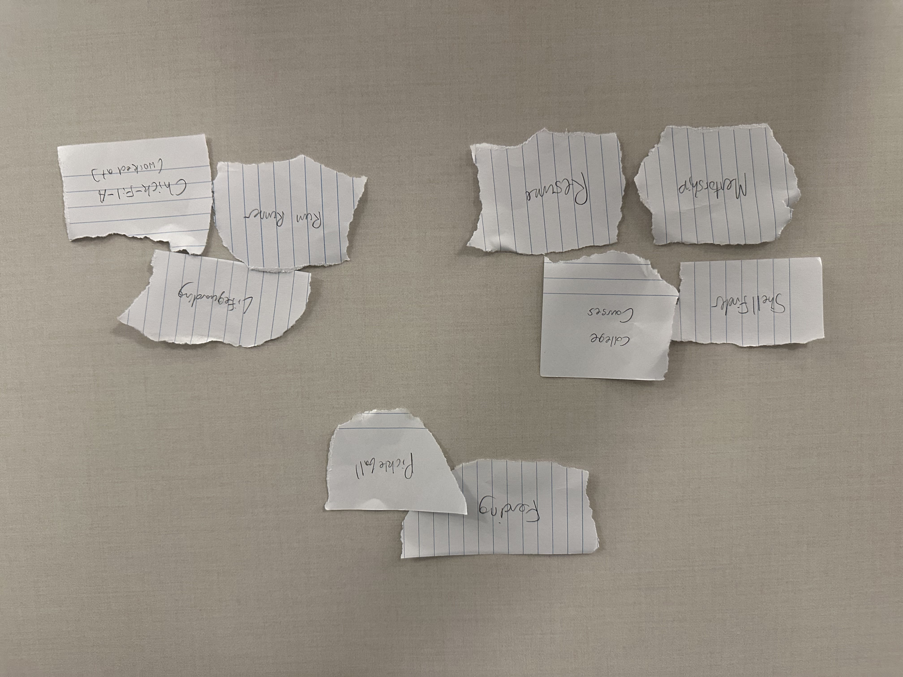
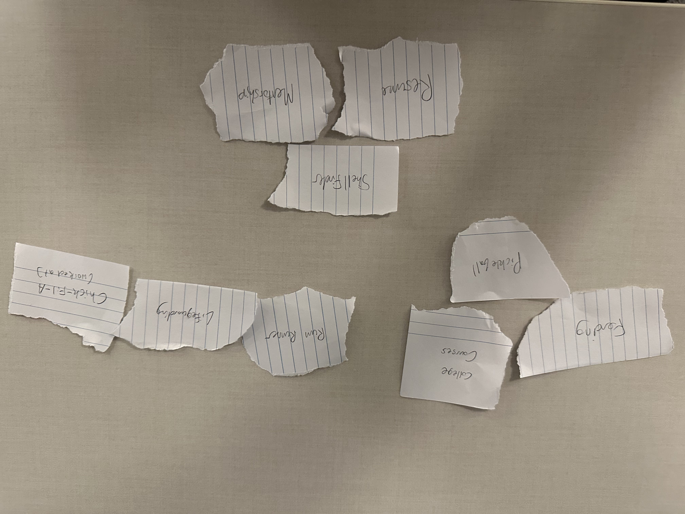

# Project 1, Milestone 3: Design Journey

[← Table of Contents](design-journey.md)

**Replace ALL _TODOs_ with your work.** (There should be no TODOs in the final submission.)

Be clear and concise in your writing. Bullets points are encouraged.

Place all design journey images inside the "design-plan" folder and then link them in Markdown so that they are visible in Markdown Preview.

**Everything, including images, must be visible in _Markdown: Open Preview_.** If it's not visible in the Markdown preview, then we can't grade it. We also can't give you partial credit either. **Please make sure your design journey should is easy to read for the grader;** in Markdown preview the question _and_ answer should have a blank line between them.

## Milestone 2 Feedback Revisions
> Explain what you revised in response to the Milestone 2 feedback (1-2 sentences)
> If you didn't make any revisions, explain why.
> AFTER MILESTONE 2 FEEDBACK:
I only got points taken off in my milestone 2 submission for lisitng 'width' and 'height' as CSS properties during my analysis for the 2 example websites. I understand now that 'width' and 'height' are not treated as CSS in the same way something like a border would be.

## Information Architecture

Design the information architecture for all the pages your website.

You may change your homepage content based on your card sorting. If you do change the homepage content, you don't need to go back to the previous milestone design journey and update it. Instead, just include the new plan in the section below (Content Organization).

### Content Organization
> Document your **iterations** of card sorting here.
> You should have at least 2 iterations of card sorting.
> Include photographic evidence of each iteration of card sorting **and** description of your thought process for each iteration. (1-2 sentences)
> Please physically sort cards; please don't do this digitally.

In this iteration I have 3 groups, my academics and personal projects, sports that I like to play, and my work experience. I thought that the two sports I play, pickleball and fencing should be grouped with one another, as they are both sports. I thought that my mentorship and my app ShellFinder would fit well with my academics and my resume as these are all things associated with my interest in computer science. Finally, I put my actual work experience in a group of its own.

In this iteration I also have 3 groups, my academics and sports I played throughout school, my personal projects, and my work experience. I thought that in this iteration it would make more sense to group my personal projects and my resume into one category and leave my work experience and academic life into another category.

### Final Content Organization
> Which iteration of card sorting will you use for your website? (1 sentence)

I will be using iteration 2 of my card sorting for my website.

> Explain how the final organization of content is appropriate for your site's audiences. (1-2 sentences)

I think that that this organization of the content is appropriate for my site's audiences since it divides information about me into my work experience, my schooling experience, and my professional life life, academic life, and work life. Because my main audience would be data science / SWE recruiters who want to hire me, I think that this layout would be best to organize the different information in 3 different categories.

### Navigation
> Please list the pages you will include in your website's navigation.

- Home
- Academics
- Personal Projects
- Work Experience

> Explain why the names of these pages make sense for your site's audience. (1-2 sentences)

I think the page names make sense for my site's audience because they very simply describe the kind of content that is included in them. The Academics page has information about the courses I've taken and sports I've played at school. The personal projects page and the work experience pages let visitors view both projects I've completed in the past and the jobs I have worked at in two distinct pages.

## References

### Collaborators
> List any persons you collaborated with on this project.

Nobody.

### Reference Resources
> Did you use any resources not provided by this class to help you complete this assignment?
> List any external resources you referenced in the creation of your project. (i.e. W3Schools, StackOverflow, Mozilla, etc.)
>
> List **all** resources you used (websites, articles, books, etc.), including generative AI.
> Provide the URL to the resources you used and include a short description of how you used each resource.

I used generative AI on this assignment to produce some content for my pages.

[← Table of Contents](design-journey.md)
