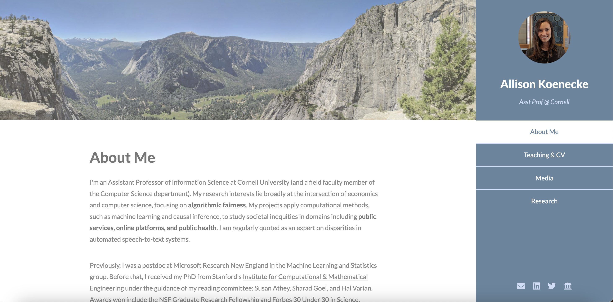
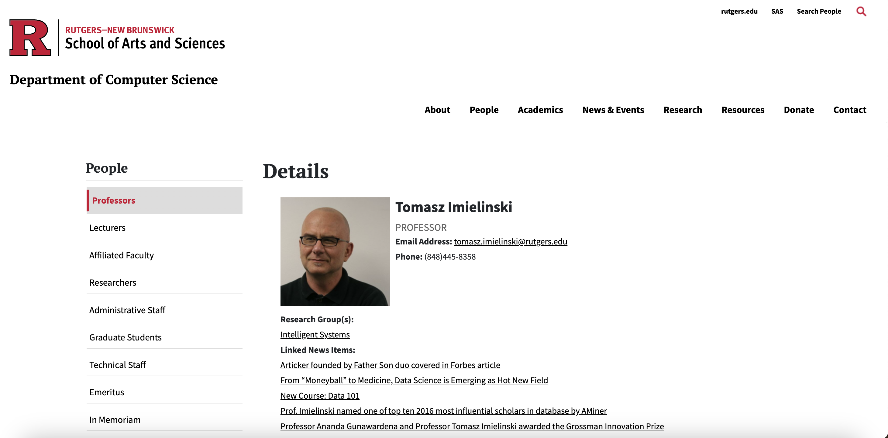
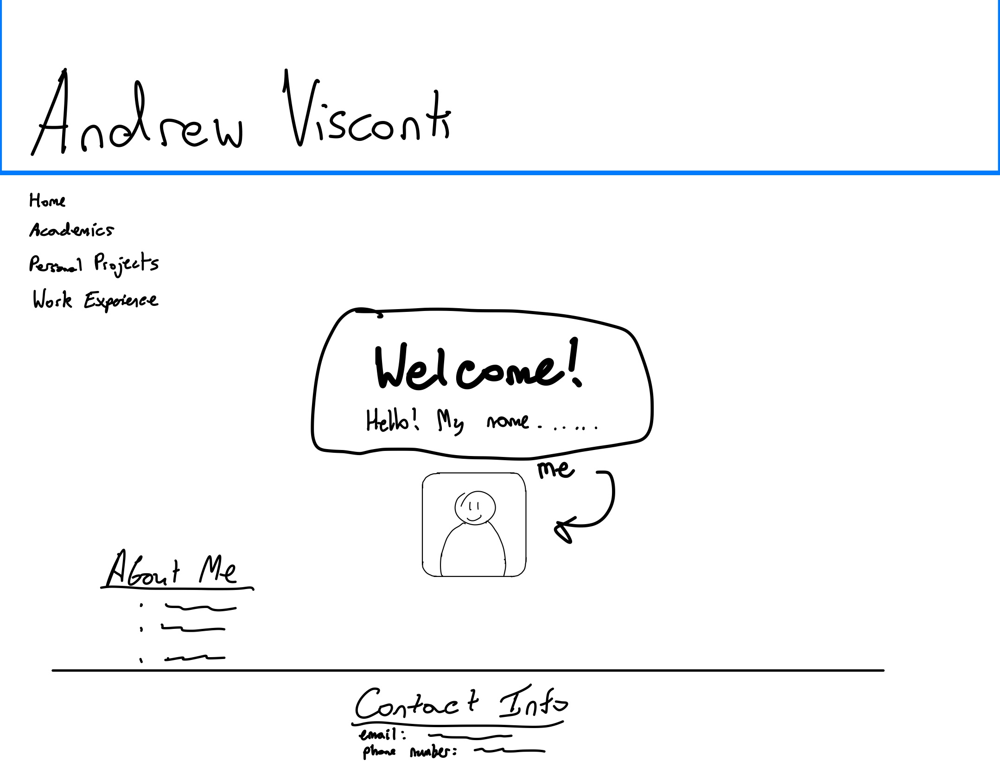
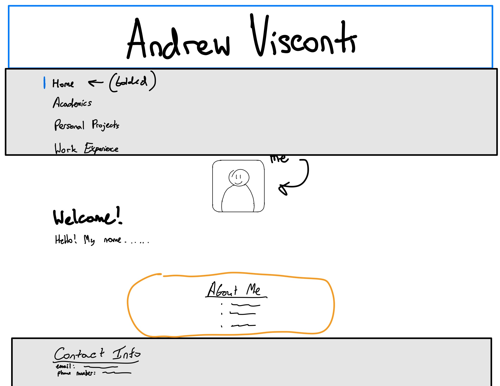
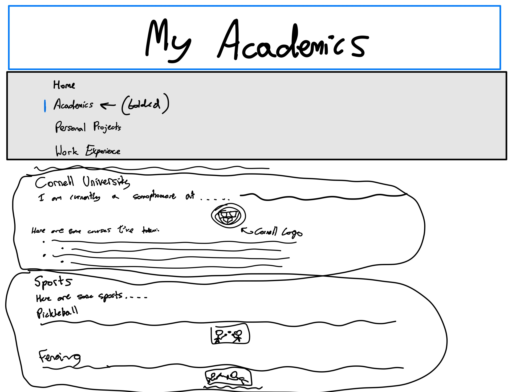
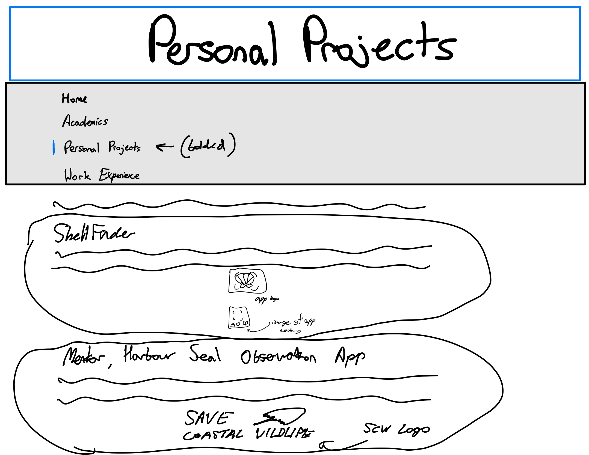
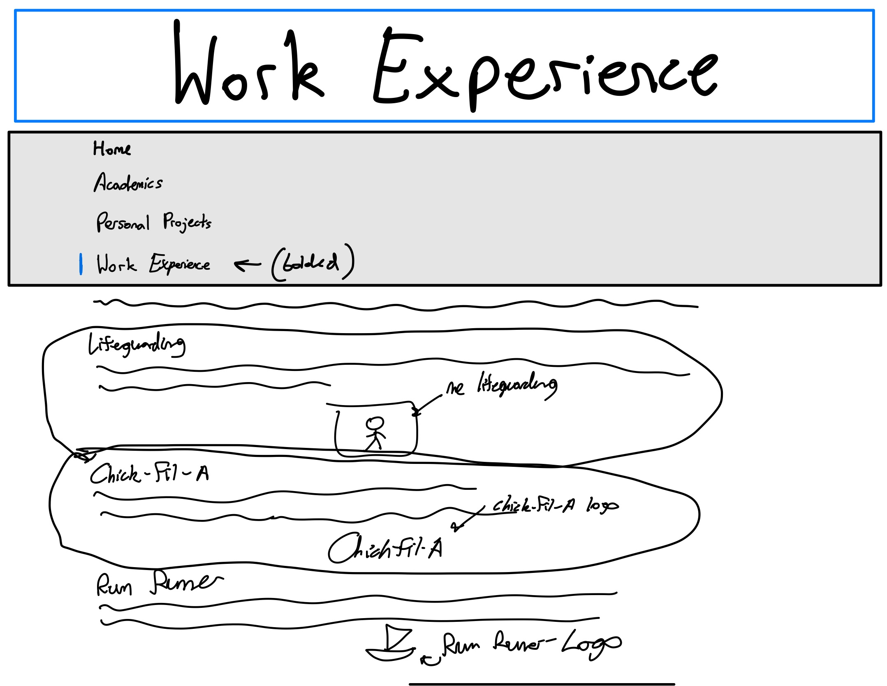

# Project 1, Final Milestone: Design Journey

[← Table of Contents](design-journey.md)

**Replace ALL _TODOs_ with your work.** (There should be no TODOs in the final submission.)

Be clear and concise in your writing. Bullets points are encouraged.

Place all design journey images inside the "design-plan" folder and then link them in Markdown so that they are visible in Markdown Preview.

**Everything, including images, must be visible in _Markdown: Open Preview_.** If it's not visible in the Markdown preview, then we can't grade it. We also can't give you partial credit either. **Please make sure your design journey should is easy to read for the grader;** in Markdown preview the question _and_ answer should have a blank line between them.

## Milestone 3 Feedback Revisions
> Explain what you revised in response to the Milestone 3 feedback (1-2 sentences)
> If you didn't make any revisions, explain why.

Looking at my milestone 3 feedback, I know now that I always need double check my work, including the spelling of code and images. I had an issue where I spelt one of the card sorting images incorrectly and received no credit for my card sorting activity. After viewing the feedback, I'll ensure to always validate my code I write before I submit it.

## Example Website Emotion Analysis

For each example website you identified in milestone 1:

1. Include the same screenshot of the example website you included in Milestone 1.
2. Reflect on the emotions your experience when using the website.
3. Analyze how the website's use of color, decorative imagery, typography, shape, and alignment contribute to these emotions.

### Example Website 1
> Provide the website's URL and a screenshot

<(https://koenecke.infosci.cornell.edu/)>

> What emotions do you feel when you look at this website's design? (1 sentence)

When I look at the design of this website, I feel very calm and relaxed.

> How does this website's use of color, decorative imagery, typography, shape, and alignment contribute to these emotions? (2-3 sentences)

Professor Koenecke uses soft and muted colors around her text that makes the content of the website seem approchable and friendly. She also includes an image of a beautiful natural landscape, probably one she took herself.

### Example Website 2
> Provide the website's URL and a screenshot

<(https://www.cs.rutgers.edu/people/professors/details/tomasz-imielinski)>

> What emotions do you feel when you look at this website's design? (1 sentence)

When I look at the design of this website, I feel a little tense and intimidated.

> How does this website's use of color, decorative imagery, typography, shape, and alignment contribute to these emotions? (2-3 sentences)

This professor uses very little imagery, dark and bold colors, and barely any spacing between the different sections of his website. In addition, because all the text is aligned to the left, the content of the website looks squished and highly concentrated on one side. All these design choices contribute to the overall website coming across as serious.

## Website Design

### Emotion Reflection
> What emotions would you like the visitors of your website to experience? Why? (1-2 sentences)

For my website, I would like my visitors to feel warm and relaxed. I want my website to have a friendly vibe so that my visitors will feel welcome and won't feel intimidated by me.

### Design Principle Brainstorm
> Reflect on how you might use color, decorative imagery, typography, shape, and alignment to evoke these emotions. (2-3 sentences)

I intend to use a blend of muted colors, pretty natural landscape images, fonts similar to sans-serif, and neat spacing between all the elements on my website to make visitors feel welcome and relaxed. I may also adjust the contrast between the colors on my website so that users can easily determine what information is important.

### Home Page Sketches
> Sketch **two** different possible designs for your home page.
> Provide an explanation for each sketch explaining the idea. (1 sentence per sketch)

For this sketch, I chose to center the welcome text and add a border and background to it with a rounded image of me below it.

For this sketch, I added a background to the navigation menu and added a border left line with bolded text to signify what tab the visitor is on. I also plan to add a background color behind the about me section. I have also added a background to the contact section.

### Entire Website's Design
> Pick the version of the home page that you will use for your final design.

For my final design, I will use sketch design 2.

> Plan the design for the rest of your website.
> Include a sketch for each of the remaining pages of your website.
> Label each sketch, so that we understand what page we are reviewing. (1 short phrase per sketch)

My Academics Page
This page includes content about my academic involvements, including classes I've taken at Cornell and Sports I have played for school in the past. The two sports are pickleball and fencing.

Personal Projects Page
This page includes two projects I have worked on in the past, along with images related to each.

Work Experiences Page
This page includes my work history acompanied with an image associated with each job. I have 3 of my previous jobs that I have listed on my website: Lifeguarding, Chick-Fil-A, and the Rum Runner.

### Static Website Design Check
> We're building a static website without interactivity.
> **No part of your website may dynamically change.**
> Examples of dynamic behavior are dropdown menus, hamburger menus, popups, modals/lightboxes, image carousels, etc.
> Audit your design and check that you aren't relying on any dynamic features. (1 sentence)

The design on my website is static because I have not implemented any javascript code to change the way the content appears as the user views the website. Because of which, the website will remain the same and be static.

## Self-Reflection
> Take some time here to reflect on how much you've learned since you started this class. It's often easy to ignore our own progress. Take a moment and think about your accomplishments in this class. Hopefully you'll recognize that you've accomplished a lot and that you should be very proud of those accomplishments!

Over the course of this project, I've learned a lot about web development, HTML, and CSS. Before taking this class, I had little to no experience with any of those topics. But now, I can understand what many HTML elements do and how I can implement them on my website.

## References

### Collaborators
> List any persons you collaborated with on this project.

None.

### Reference Resources
> Did you use any resources not provided by this class to help you complete this assignment?
> List any external resources you referenced in the creation of your project. (i.e. W3Schools, StackOverflow, Mozilla, etc.)
>
> List **all** resources you used (websites, articles, books, etc.), including generative AI.
> Provide the URL to the resources you used and include a short description of how you used each resource.

None.

[← Table of Contents](design-journey.md)
